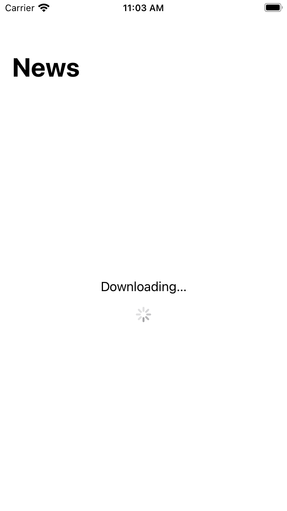
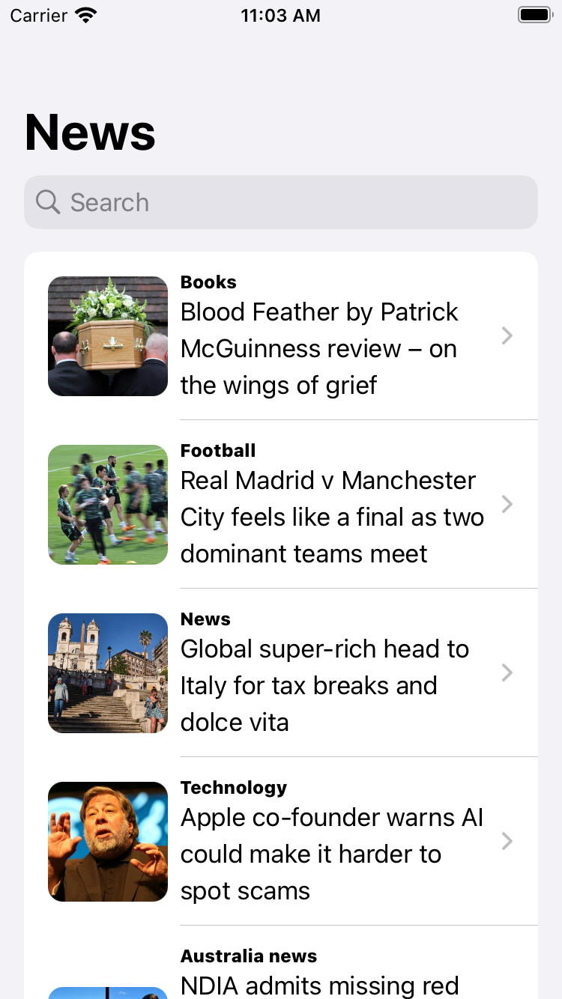
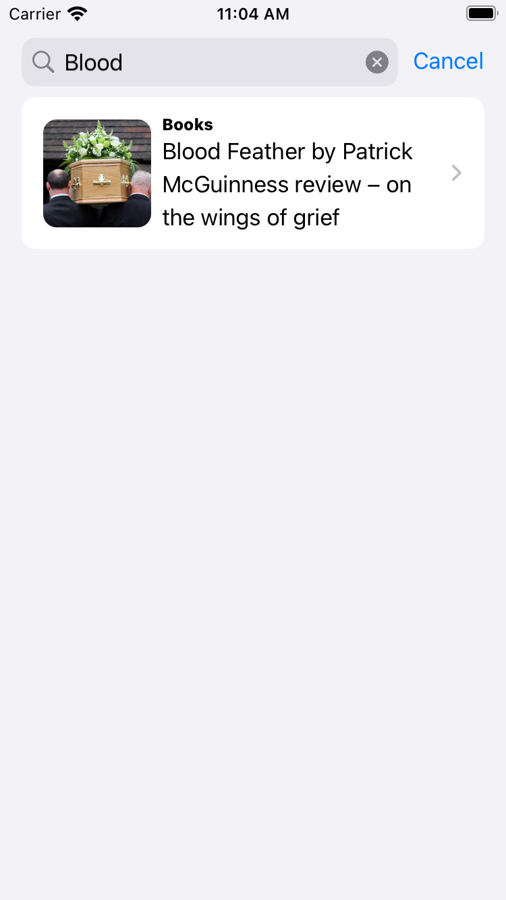
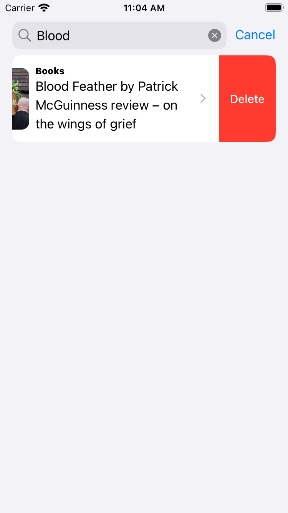
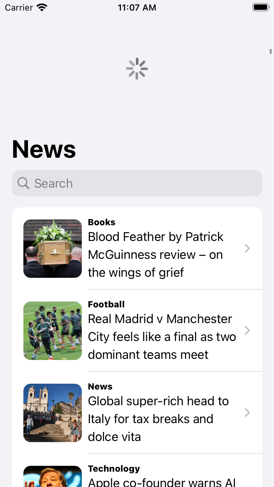

# NewsApp
This is my second app built with SwiftUI
#### Functionalities
* Fetch news from https://hws.dev/news
* Search news
* Refresh news
* Delete news
* Visit the news page on the web

## Screenshots
Loading             |  News
:-------------------------:|:-------------------------:
  |  

Search             |  Search result
:-------------------------:|:-------------------------:
  |  

Delete             |  Refresh
:-------------------------:|:-------------------------:
  |  

Details  
